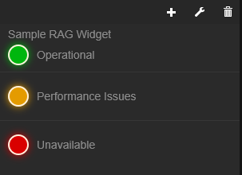
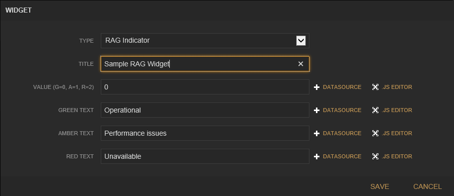

Freeboard RAG Widget Plugin
===============

This is a widget plugin for http://freeboard.io that displays a simple RAG (Red/Amber/Green) Indicator.

#### Installation

Include the widget.ragIndicator.js in your main web page for freeboard, after the base 'freeboard.widgets.js' file and any other widget plugin files.

This plugin uses the http://jquerykeyframes.github.io/jQuery.Keyframes/ plugin to create keyframes for the flashing lights.  Copy the jquery.keyframes/jquery.keyframes.min.js file to the plugins/thirdparty folder of your Freeboard installation.

#### Overview

This widget displays a different coloured light depending on the value received.  The light can also be set to flashing or  dimmed.

#####0 Green light
#####1 Amber light
#####2 Red light

####Widget Settings

#####Value
Requires an integer.  Accepted values are 0 (Green), 1 (Amber) and 2 (Red).

#####Green Text
The text to show when the light is green. This can be linked to a dynamic datasource or be statically set.

#####Amber Text
The text to show when the light is amber.  This can be linked to a dynamic datasource or be statically set.

#####Red Text
The text to show when the light is green. This can be linked to a dynamic datasource or be statically set.

#####Type (Optional)
An optional setting that can set the light to be Dim or make it Flash. If set to null or any other value it will show a solid light as per normal.
